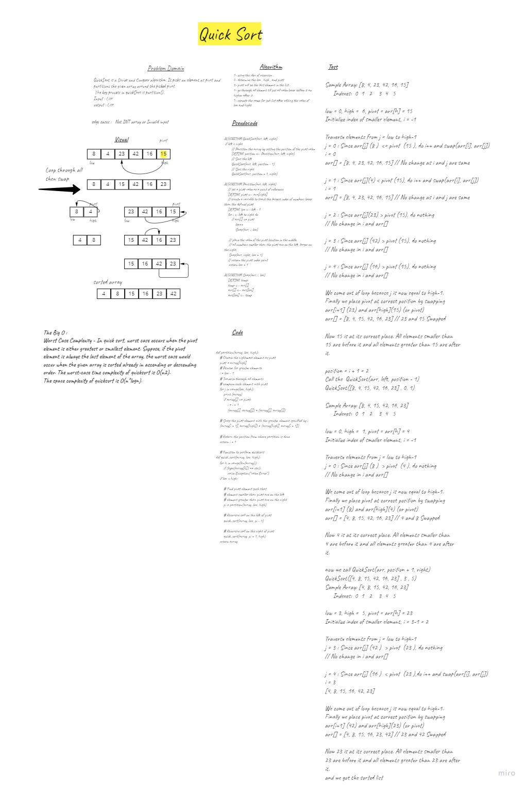

# Challenge Summary
Tace Quick  algorithem , which is a Divide and Conquer algorithm. It picks an element as pivot and partitions the given array around the picked pivot.
 The key process in quickSort is partition().
Input : List
output : List

## Whiteboard Process

## Approach & Efficiency
Worst Case Complexity - In quick sort, worst case occurs when the pivot element is either greatest or smallest element. Suppose, if the pivot element is always the last element of the array, the worst case would occur when the given array is sorted already in ascending or descending order. The worst-case time complexity of quicksort is O(n2).
The space complexity of quicksort is O(n*logn).

## Solution
1- using the idea of recursion .
2- determine the low , high , and pivot
3- pivot will be the last element in the list .
4- go through all element till put all value lower before it an higher after it
5- repaete the same for sub list after editing the value of low and hight