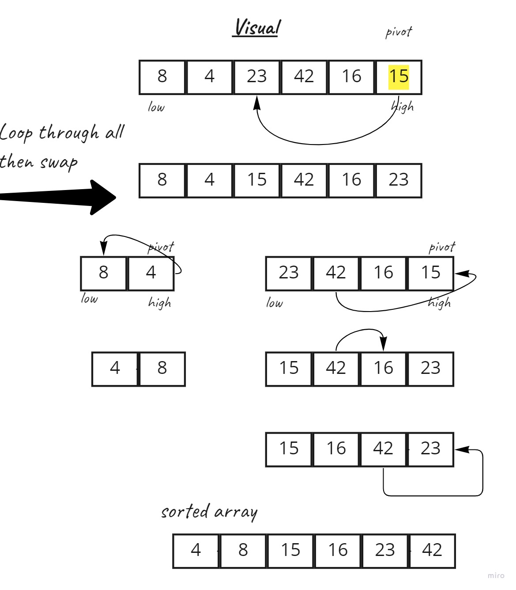

# Quick Sort
 QuickSort is a Divide and Conquer algorithm. It picks an element as pivot and partitions the given array around the picked pivot.
 The key process in quickSort is partition(). Target of partitions is, given an array and an element x of array as pivot, put x at its correct position in sorted array and put all smaller elements (smaller than x) before x, and put all greater elements (greater than x) after x. All this should be done in linear time.

## Pseudocode

ALGORITHM QuickSort(arr, left, right)
    if left < right
        // Partition the array by setting the position of the pivot value
        DEFINE position <-- Partition(arr, left, right)
        // Sort the left
        QuickSort(arr, left, position - 1)
        // Sort the right
        QuickSort(arr, position + 1, right)

ALGORITHM Partition(arr, left, right)
    // set a pivot value as a point of reference
    DEFINE pivot <-- arr[right]
    // create a variable to track the largest index of numbers lower than the defined pivot
    DEFINE low <-- left - 1
    for i <- left to right do
        if arr[i] <= pivot
            low++
            Swap(arr, i, low)

     // place the value of the pivot location in the middle.
     // all numbers smaller than the pivot are on the left, larger on the right.
     Swap(arr, right, low + 1)
    // return the pivot index point
     return low + 1

ALGORITHM Swap(arr, i, low)
    DEFINE temp;
    temp <-- arr[i]
    arr[i] <-- arr[low]
    arr[low] <-- temp

## Trace
Sample Array: [8, 4, 23, 42, 16, 15]
     Indexes:  0  1   2    3  4   5

low = 0, high =  6, pivot = arr[h] = 15
Initialize index of smaller element, i = -1

Traverse elements from j = low to high-1
j = 0 : Since arr[j] (8 )  <= pivot  (15 ), do i++ and swap(arr[i], arr[j])
i = 0 
arr[] = [8, 4, 23, 42, 16, 15] // No change as i and j are same

j = 1 : Since arr[j](4) < pivot (15), do i++ and swap(arr[i], arr[j])
i = 1 
arr[] = [8, 4, 23, 42, 16, 15] // No change as i and j are same

j = 2 : Since arr[j](23) > pivot (15), do nothing
// No change in i and arr[]

j = 3 : Since arr[j] (42) > pivot (15), do nothing
// No change in i and arr[]

j = 4 : Since arr[j] (16) > pivot (15), do nothing
// No change in i and arr[]

We come out of loop because j is now equal to high-1.
Finally we place pivot at correct position by swapping
arr[i+1] (23) and arr[high](15) (or pivot) 
arr[] = [8, 4, 15, 42, 16, 23] // 23 and 15 Swapped 

Now 15 is at its correct place. All elements smaller than
15 are before it and all elements greater than 15 are after
it.

position = i + 1 = 2
Call the  QuickSort(arr, left, position - 1)
QuickSort([8, 4, 15, 42, 16, 23] , 0, 1)

Sample Array: [8, 4, 15, 42, 16, 23]
     Indexes:  0  1   2    3  4   5

low = 0, high =  1, pivot = arr[h] = 4
Initialize index of smaller element, i = -1

Traverse elements from j = low to high-1
j = 0 : Since arr[j] (8 )  > pivot  (4 ), do nothing
// No change in i and arr[]

We come out of loop because j is now equal to high-1.
Finally we place pivot at correct position by swapping
arr[i+1] (8) and arr[high](4) (or pivot) 
arr[] = [4, 8, 15, 42, 16, 23] // 4 and 8 Swapped 

Now 4 is at its correct place. All elements smaller than
4 are before it and all elements greater than 4 are after
it.

now we call QuickSort(arr, position + 1, right)
QuickSort([4, 8, 15, 42, 16, 23] , 3 , 5)
Sample Array: [4, 8, 15, 42, 16, 23]
     Indexes:  0  1   2    3  4   5

low = 3, high =  5, pivot = arr[h] = 23
Initialize index of smaller element, i = 3-1 = 2

Traverse elements from j = low to high-1
j = 3 : Since arr[j] (42 )  > pivot  (23 ), do nothing
// No change in i and arr[]

j = 4 : Since arr[j] (16 )  < pivot  (23 ),do i++ and swap(arr[i], arr[j])
i = 3
[4, 8, 15, 16, 42, 23]

We come out of loop because j is now equal to high-1.
Finally we place pivot at correct position by swapping
arr[i+1] (42) and arr[high](23) (or pivot) 
arr[] = [4, 8, 15, 16, 23, 42] // 23 and 42 Swapped 

Now 23 is at its correct place. All elements smaller than
23 are before it and all elements greater than 23 are after
it.
and we got the sorted list 

### Illustrations:

Efficency
Worst Case Complexity - In quick sort, worst case occurs when the pivot element is either greatest or smallest element. Suppose, if the pivot element is always the last element of the array, the worst case would occur when the given array is sorted already in ascending or descending order. The worst-case time complexity of quicksort is O(n2).
The space complexity of quicksort is O(n*logn).