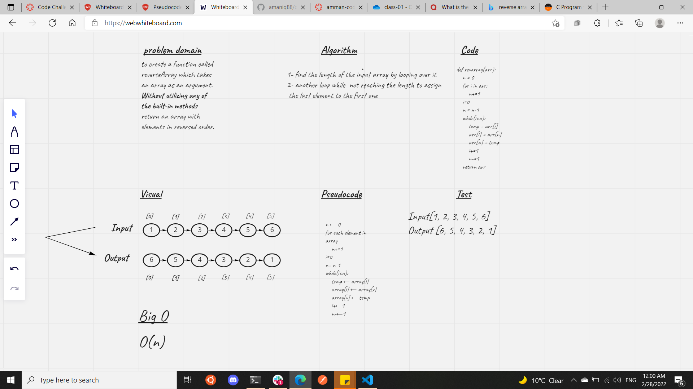

# Table of Contents
1. [Code Challenge: Class 01]()

# Reverse an Array
to do the whiteboard process for the reverse array function withour using any built in function 

## Whiteboard Process

## Approach & Efficiency
looping through the array using for loop  to determin the number of element in  the array then using the while loop to reassign the elements by reversing the index big O her is O(n)  we are consuming time and space only as the element number n .

