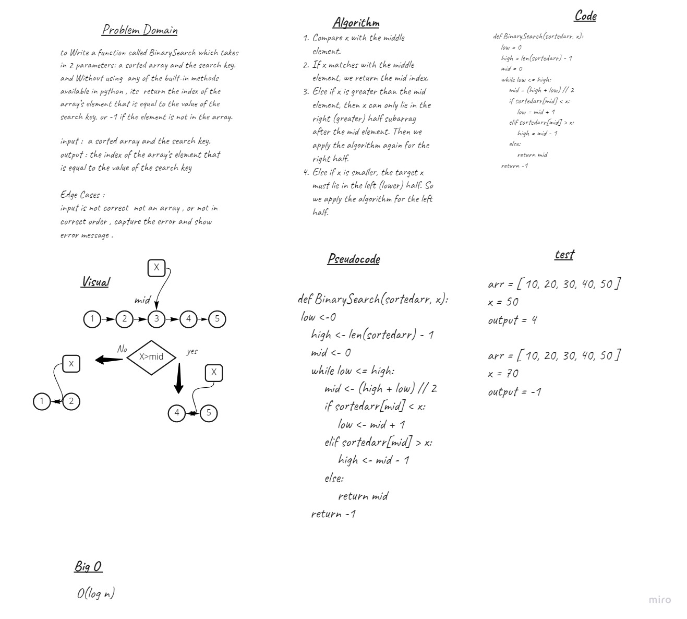

# Binary Search of Sorted Array
to Write a function called BinarySearch which takes in 2 parameters: a sorted array and the search key. and Without using  any of the built-in methods available in python , its  return the index of the array’s element that is equal to the value of the search key, or -1 if the element is not in the array.
## Whiteboard Process

## Approach & Efficiency
O(log n)  =>  worse and average case
O(1)      =>  Best case