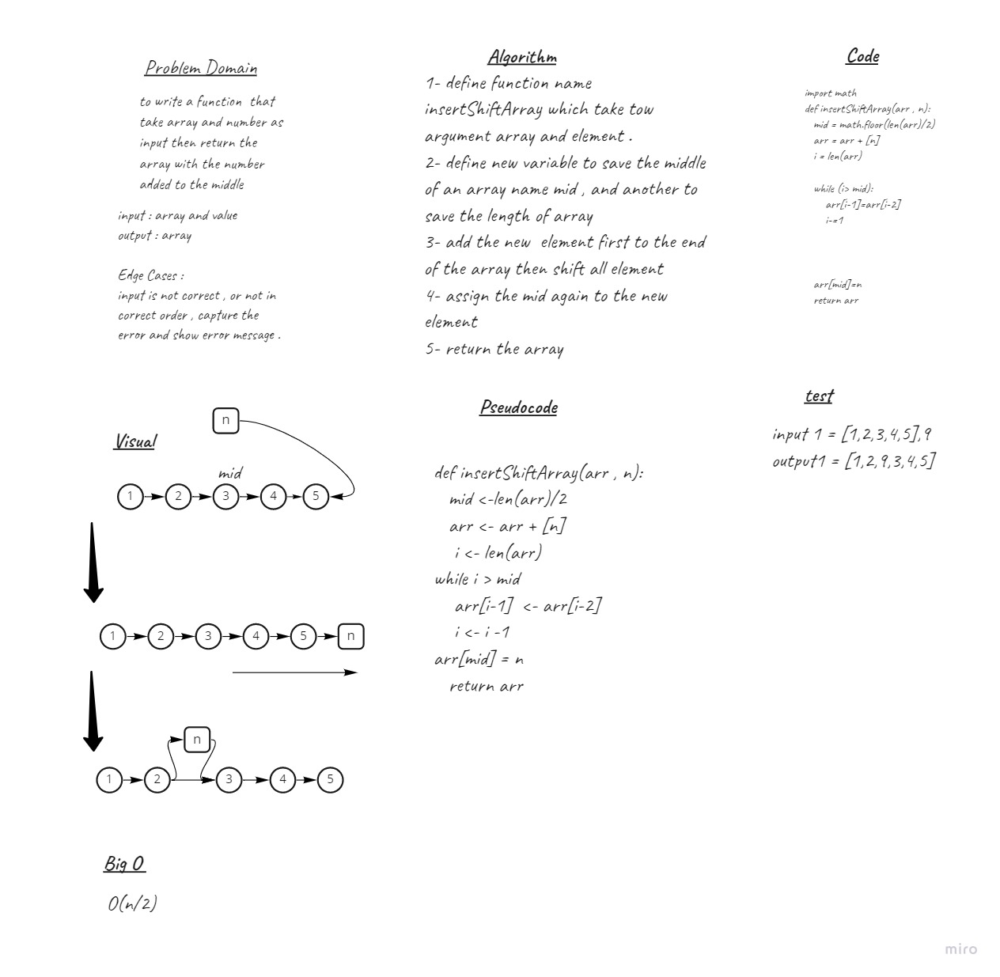

# Insert to Middle of an Array
to write a function  that take array and number as input then return the array with the number added to the middle

## Whiteboard Process

## Approach & Efficiency
its done by determine the middle of the array then append the new element to increase the array size first then shift all element from middle the assign the midle to the new element O(n/2)