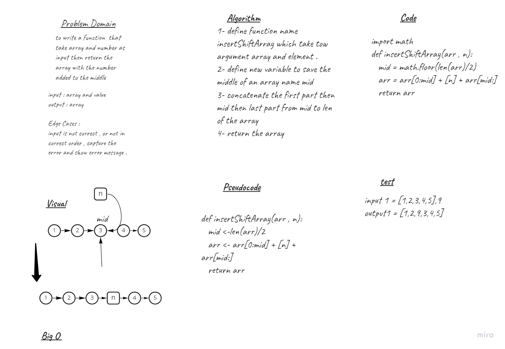

# Insert to Middle of an Array
to write a function  that take array and number as input then return the array with the number added to the middle

## Whiteboard Process

## Approach & Efficiency
its done by determine the middle of the array then concatenate the data first part then the element then the last part 