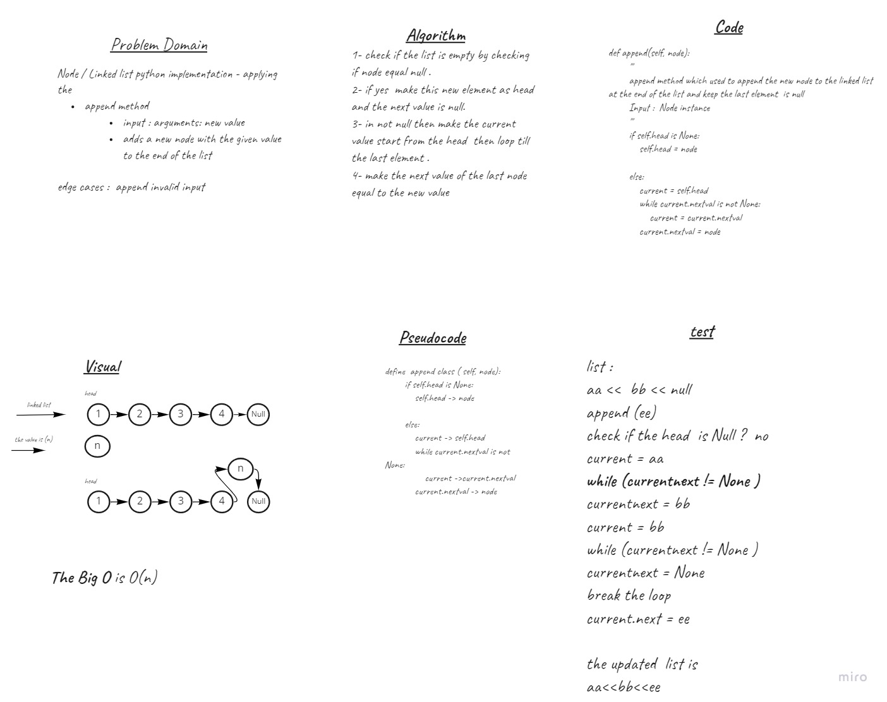
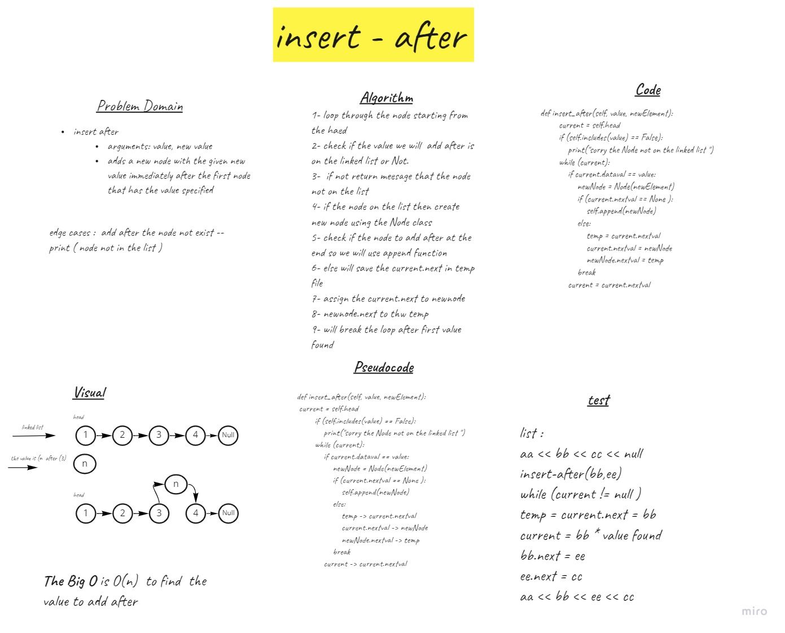

# Challenge Summary
Node and Linked List using python classes 

## Whiteboard Process
Append

Insert After 

Insert Before 

## Approach & Efficiency
creat a Node and Linkedlist classes 
methods used  
1- Append New Node to the End
2- Insert New Node at the Head
3- Inser New Node Before Certain value 
4- Insert New Node After Certain Value
5- Includes Function to check if the value is there or Not   

## Solution
Two Classes Created  Node , Linked LIst 
Node Has Two vlaue , data of the Node and the NetValue 
Linked List pointed to the Head value and initail it to None At the creation , 
5 methods used to do single task each 
( Append , Insert , Insert_before , Insert_After , Includes )

