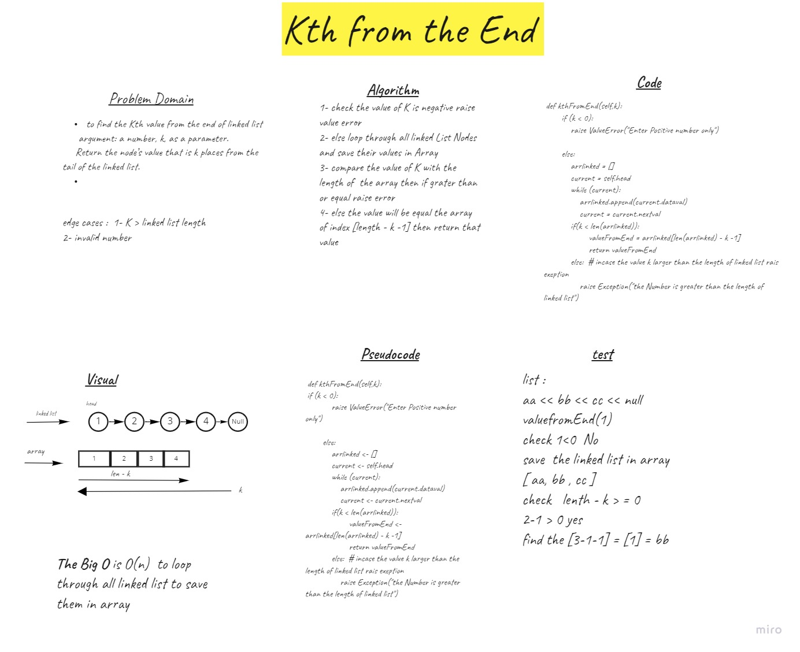

# Challenge Summary
Node and Linked List using python classes - 
k-th value from the end of a linked list.
argument: a number, k, as a parameter.
Return the node’s value that is k places from the tail of the linked list.

## Whiteboard Process

## Approach & Efficiency
O(n)  we loop through the all linkedlist Nodes to save them in array 

## Solution
1- check the value of K is negative raise value error
2- else loop through all linked List Nodes and save their values in Array
3- compare the value of K with the length of  the array then if grater than or equal raise error
4- else the value will be equal the array of index [length - k -1] then return that value

