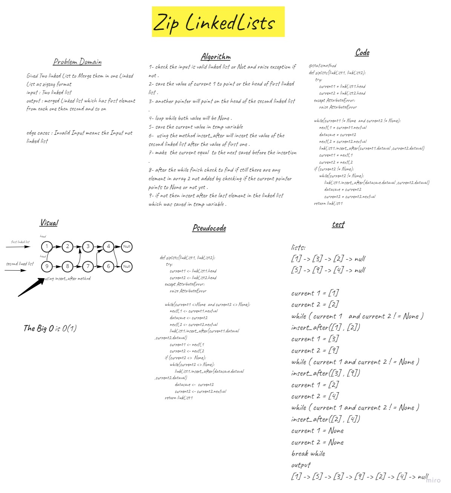

# Challenge Summary
Gived Two linked List to Merge them in one Linked List as zigzag format
input : Two linked list
output : merged Linked list which has first element from each one then second and so on

## Whiteboard Process

## Approach & Efficiency
O(1)  use  the first linkedList to insert the Nodes of the scond one 

## Solution
1- check the input is valid linked list or Not and raise exception if not .
2- save the value of current 1 to point or the head of first linked list .
3- another pointer will point on the head of the second linked list .
4- loop while both value will be None .
5- save the current value in temp variable
6-  using the method insert_after will insert the value of the second linked list after the value of first one .
7- make  the current equal  to the next saved before the insertion .
8- after the while finish check to find if still there are any element in array 2 not added by checking if the current pointer points to None or not yet .
9- if not then insert after the last element in the linked list which was saved in temp variable .

