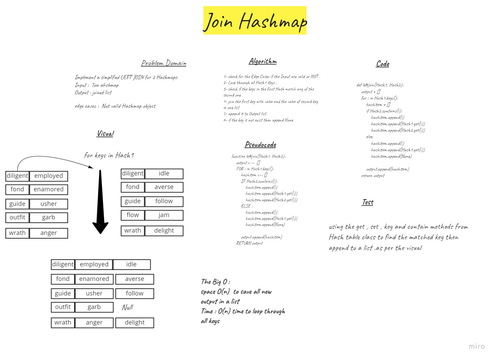

# Hashmap LEFT JOIN
Implement a simplified LEFT JOIN for 2 Hashmaps.
Input :  Tow ahshmap
Output : joined list

## Challenge
1- check for the Edge Cases if the Input are valid or NOT .
2- Loop through all Hash1 Keys ,
3- check if the keys in the first Hash match any of the second one
4- join the first key with value and the value of second key in one list
5- append it to Output list
6- if the key is not exist then append None

## Approach & Efficiency
loop through all Hahsh1 keys and compair with the scond Hashkeys 
The Big O :
space O(n)  to save all new output in a list
Time : O(n) time to loop through all keys 

## Solution

