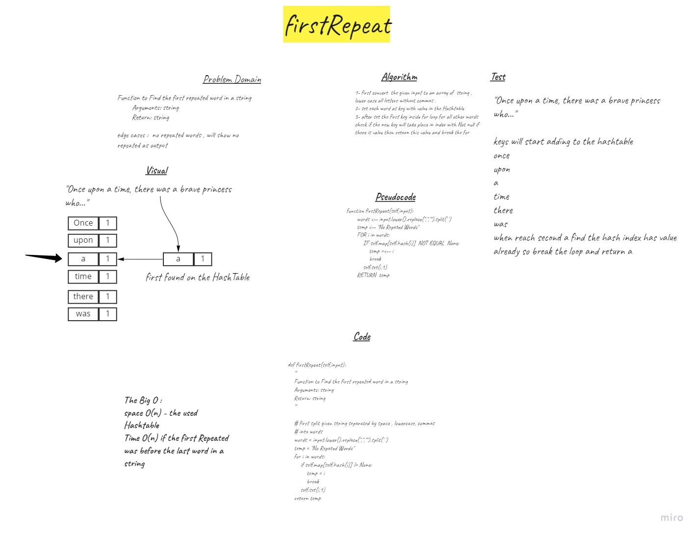

# Challenge Summary
Function to Find the first repeated word in a string
        Arguments: string
        Return: string
## Whiteboard Process

## Approach & Efficiency
space O(n) - the used Hashtable
Time O(n) if the first Repeated was before the last word in a string 

## Solution
1- first convert  the given input to an array of  string , lower case all letters without commas .
2- set each word as key with value in the Hashtable
3- after set the first key inside for loop for all other words check if the new key will take place in index with Not null if there is value then return this value and break the for