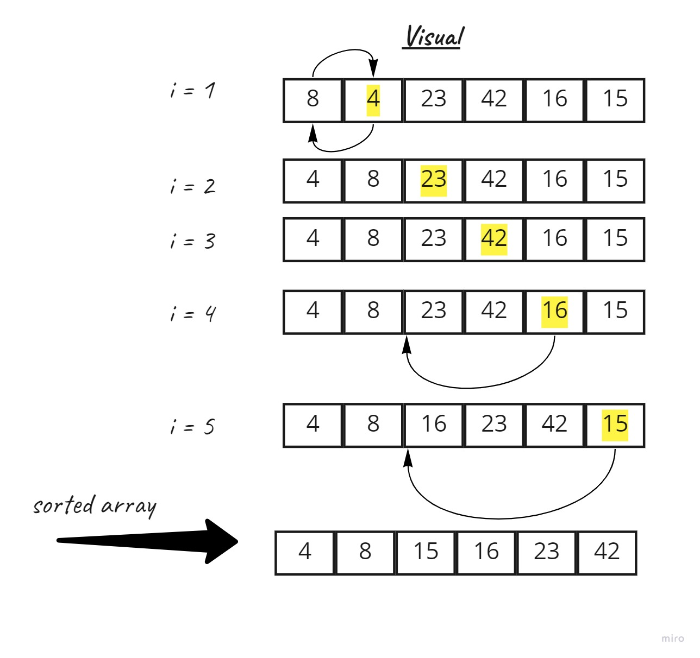

# Insertion Sort
is a simple sorting algorithm . The array is virtually split into a sorted and an unsorted part. Values from the unsorted part are picked and placed at the correct position in the sorted part.

## Pseudocode

InsertionSort(int[] arr)

    FOR i = 1 to arr.length

      int j <-- i - 1
      int temp <-- arr[i]

      WHILE j >= 0 AND temp < arr[j]
        arr[j + 1] <-- arr[j]
        j <-- j - 1

      arr[j + 1] <-- temp

## Trace
Sample Array: [8,4,23,42,16,15]

**Pass 1:**

[8,4,23,42,16,15]          (i = 1)
   j = 0     tepmp = 4   < arr[0]=8   --> enter while loop 
==> arr[1] = 8
    j = -1     arr[0] = 4
in the first pass compir the first value with the scond value in the array , and in this case the scond is smaller then swap the two element, and becuse the value of j < 0 break the while loop and contenue to the scond pass .

**Pass 2:**

[4,8,23,42,16,15]           (i = 2)
    j = 1     tepmp = 23   > arr[1]=8   --> Not enter the  while loop 

in the scond pass we pic the scond value and compir with the third in this case the scond is smaller , means will not enter the while loop , No changes on the array elemnet and contenue to the next pass .

**Pass 3:**

[4,8,23,42,16,15]           (i = 3)
j = 2     tepmp = 42   > arr[2]=23   --> Not enter the  while loop 

in the third pass we pic the third value and compir with the forth in this case the third is smaller , means will not enter the while loop , No changes on the array elemnet and contenue to the next pass .

**Pass 4:**

[4,8,23,42,16,15]           (i = 4)
| J      | Tempp | arr[j]  |
| ------ | ------| --------| 
| 3      | 16    |   42    |  Enter While loop   ==> arr[4]= 42
| 2      | 16    |   23    |  Enter While loop   ==> arr[3]= 23
| 1      | 16    |   8     |  Not Enter While loop   ==> arr[2]= 16

In the forth pass the Forth value compired with fifth in the array and becuse the forth (42) is bigger than the fifth (16) will do assin the value of fifth to the forth position in the array , then reduce the amount of J and contenue in the while loop , when J = 2 , go back and compir with the third element which is bigger value in this case so assign the value third to the forth position ,  then reduce the amount of J and contenue in the while loop , when J = 1 , go back and compir with the scond  element which is smaller  value in this case , means will not enter the loop  contenue to the next pass .

**Pass 5:**

[4,8,16, 23, 42, 15]           (i = 5)
| J      | Tempp | arr[j]  |
| ------ | ------| --------| 
| 4      | 15    |   42    |  Enter While loop   ==> arr[5]= 42
| 3      | 15    |   23    |  Enter While loop   ==> arr[4]= 23
| 2      | 15    |   16    |  Enter While loop   ==> arr[3]= 16
| 1      | 15    |   8     |  NOT Enter While loop   ==> arr[2]= 15

END THE LOOP ==>  We got the sorted list [4,8, 15,16, 23, 42] 

In the fifth pass the fifth value compired with sixth in the array and becuse the fifth (42) is bigger than the sixth (15) will do assin the value of sixth to the fifth position in the array , then reduce the amount of J and contenue in the while loop , when J = 3 , go back and compir with the foth element (23) which is bigger value in this case so assign the value forth  to the fifth position ,  then reduce the amount of J and contenue in the while loop , when J = 2 , go back and compir with the third element (16) which is bigger than (15) , so assign the forth position of the array to 16 , then reduce the amount of J = 1,  go back and compir with the scond elemnet(8) which is smaller  value in this case , means will not enter the loop and we have finished the iterations and got the sorted list .

### Illustrations:

Efficency
Time: O(n^2)
The basic operation of this algorithm is comparison. This will happen n * (n-1) number of times…concluding the algorithm to be n squared.
Space: O(1)
No additional space is being created. This array is being sorted in place…keeping the space at constant O(1).