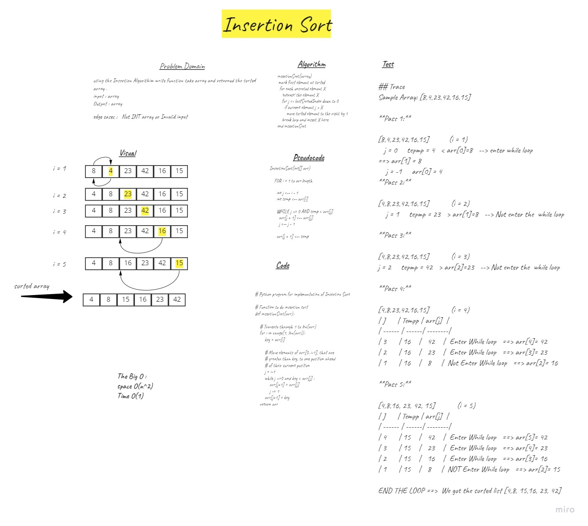

# Challenge Summary
trace the Insertion Sort  algorithm by stepping through the process . Document the  explanation by creating a blog article that shows the step-by-step output after each iteration through some sort of visual.

## Whiteboard Process

## Approach & Efficiency
Time: O(n^2)
The basic operation of this algorithm is comparison. This will happen n * (n-1) number of times…concluding the algorithm to be n squared.
Space: O(1)
No additional space is being created. This array is being sorted in place…keeping the space at constant O(1).

## Solution
insertionSort(array)
 mark first element as sorted
  for each unsorted element X
    'extract' the element X
    for j <- lastSortedIndex down to 0
      if current element j > X
        move sorted element to the right by 1
    break loop and insert X here
end insertionSort