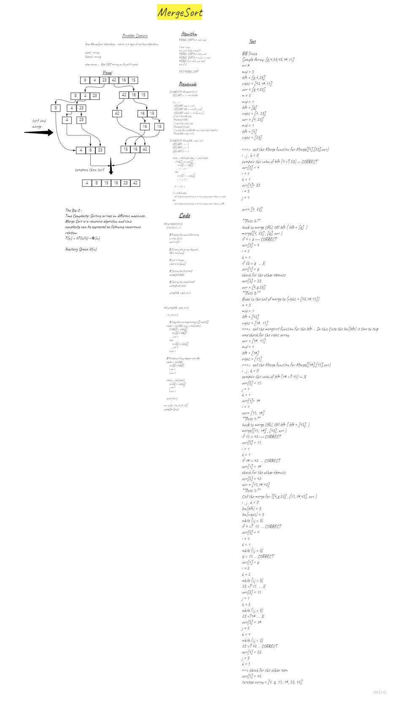

# Challenge Summary
Tace MergeSort algorithem , which is a type of sorting algorithim

## Whiteboard Process

## Approach & Efficiency
Time Complexity: Sorting arrays on different machines. Merge Sort is a recursive algorithm and time complexity can be expressed as following recurrence relation. 
T(n) = 2T(n/2) + θ(n)

Auxiliary Space: O(n)

## Solution
MERGE_SORT(arr, beg, end)

if beg < end
set mid = (beg + end)/2
MERGE_SORT(arr, beg, mid)
MERGE_SORT(arr, mid + 1, end)
MERGE (arr, beg, mid, end)
end of if

END MERGE_SORT
