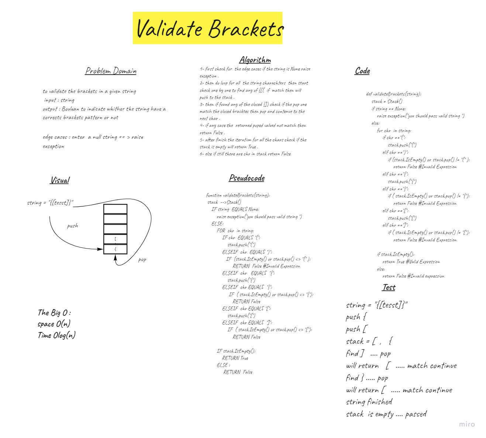

# Challenge Summary
to validate the brackets in a given string 
 input : string
output : Boolean to indicate whither the string have a corrects brackets pattern or not

## Whiteboard Process

## Approach & Efficiency
The Big O :
space O(n)
Time Olog(n)
Approch is to do iteration and check chr in a string and check on each case and push to the stack 

## Solution
1- first check for  the edge cases if the string is None raise exception .
2- then do loop for all  the string charachters  then start check one by one to find any of {[(  if  match then will push to the stack .
3- then if found any of the closed }]) check if the pop one match the closed bracktes then pop and contenue to the next char .
4- if any case the  returned poped valued not match then return False .
5- after finish the iteration for all the chars check if the stack is empty will return True .
6- else if still there are chr in stack return False