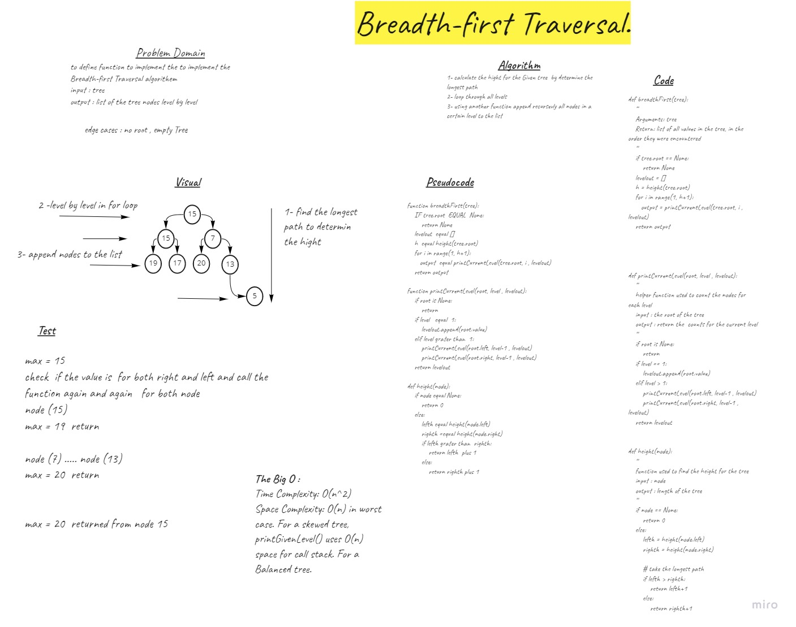

## Challenge Summary
to implement the Breadth-first Traversal algorithem 

## Whiteboard Process

## Approach & Efficiency
Time Complexity: O(n^2) 
Space Complexity: O(n) in worst case. For a skewed tree, printGivenLevel() uses O(n) space for call stack. For a Balanced tree.

use recurion idea  2 helper function to do the traversal one for finding the hight then to count the  nodes level by level 

## Solution
1- calculate the hight for the Given tree  by determine the longest path
2- loop through all levels
3- using another function append recursevly all nodes in a certain level to the list