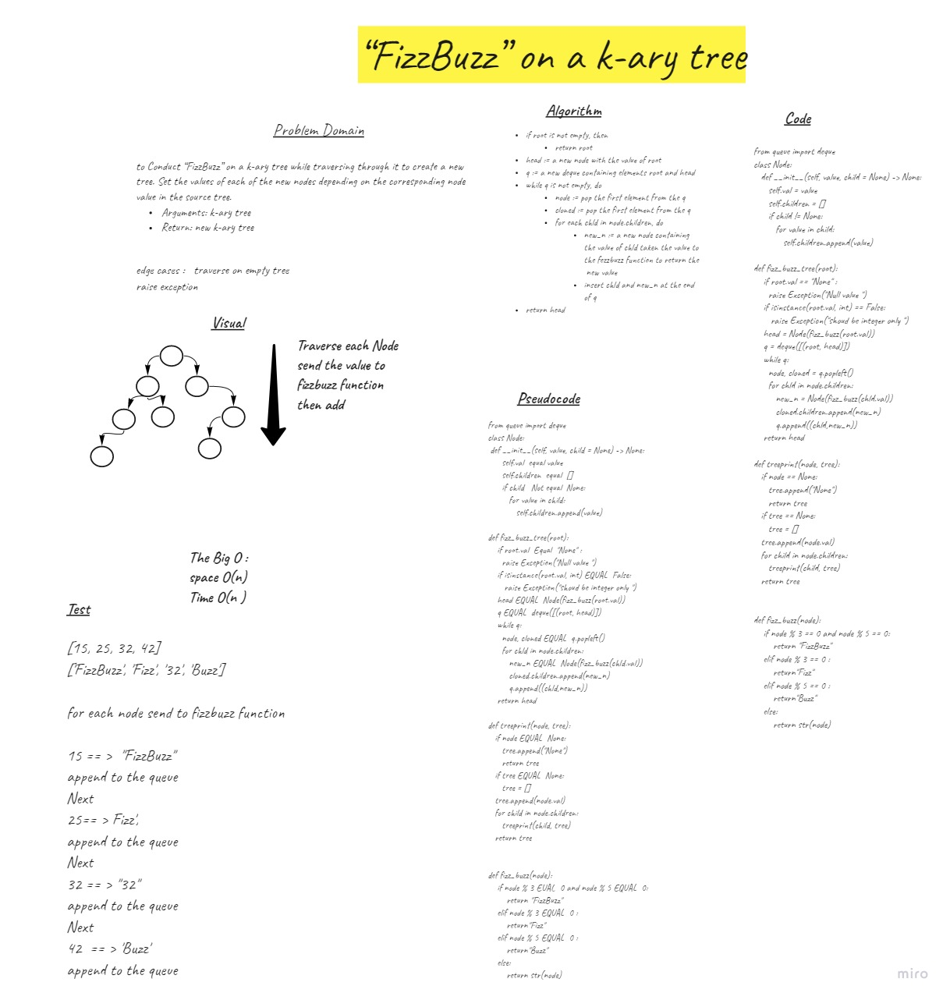

# Challenge Summary
to Conduct “FizzBuzz” on a k-ary tree while traversing through it to create a new tree.

Set the values of each of the new nodes depending on the corresponding node value in the source tree.

## Whiteboard Process

## Approach & Efficiency
using queue  to copy the Tree with changing the nodes value as per fizz buzz 
The Big O :
space O(n)
Time O(n )

## Solution
if root is not empty, then
return root
head := a new node with the value of root
q := a new deque containing elements root and head
while q is not empty, do
node := pop the first element from the q
cloned := pop the first element from the q
for each chld in node.children, do
new_n := a new node containing the value of chld taken the value to the fezzbuzz function to return the  new value
insert chld and new_n at the end of q
return head