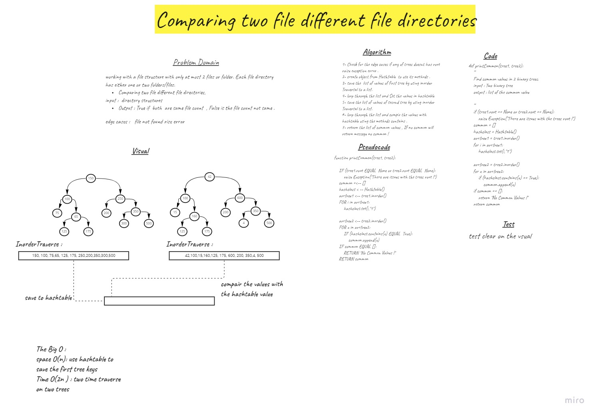

# Challenge Summary
working with a file structure with only at most 2 files or folder. Each file directory has either one or two folders/files.
Comparing two file different file directories,
input :  directory structures
Output : True if  both  are same file count  , False is the file count not same .

## Whiteboard Process

## Approach & Efficiency
The Big O :
space O(n): use hashtable to save the first tree keys 
Time O(2n ) : two time traverse on two trees

## Solution
1- Check for the edge cases if any of trees doesnt has root raise exception error .
2- create object from Hashtable  to use its methods .
3- save the  list of values of first tree by using inorder Traversal to a list.
4- loop through the list and Set the values in hashtable
5- save the list of values of second tree by using inorder Traversal to a list.
6- loop through the list and compir the values with hashtable using the methods contains .
7- return the list of common values , If no common will return messege no common !
