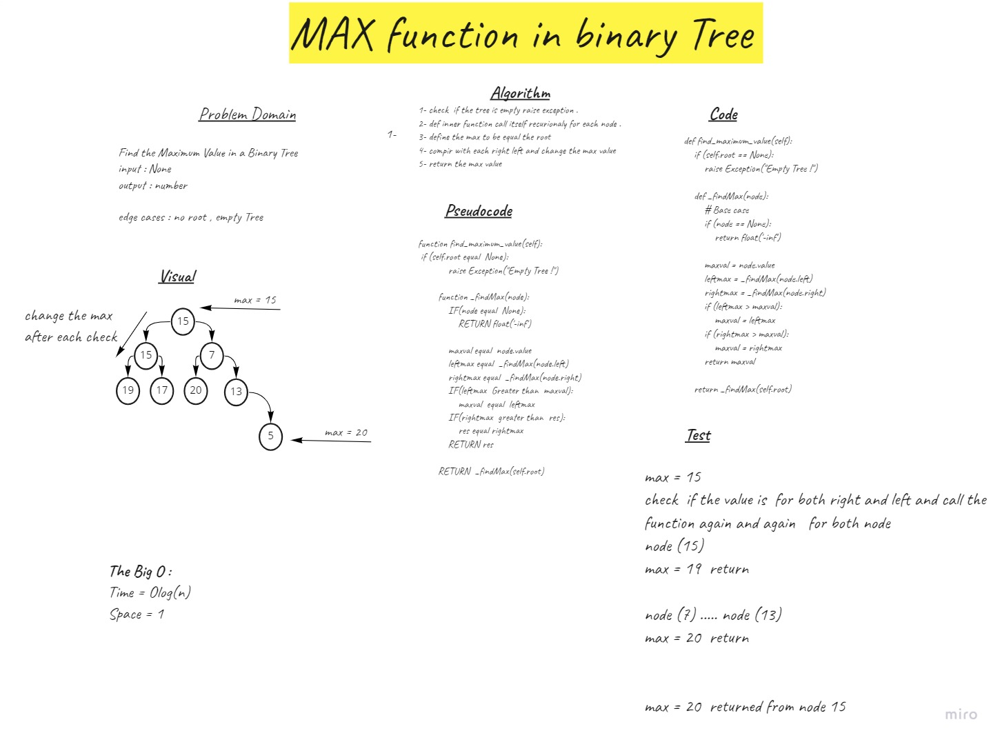

# Challenge Summary
Find the Maximum Value in a Binary Tree
where input is None 
output the max number 

## Whiteboard Process

## Approach & Efficiency
by using the recursion frunctio or function in side  other funtioh 
O(1) for Space 
O(Log2) for Time 
## Solution
1- check  if the tree is empty raise exception .
2- def inner function call itself recurionaly for each node .
3- define the max to be equal the root
4- compir with each right left and change the max value
5- return the max value